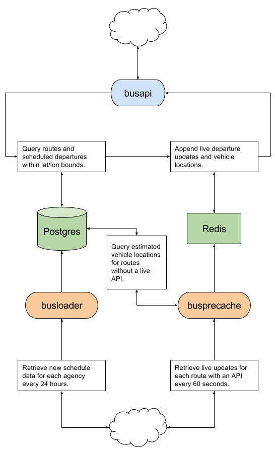

[](https://travis-ci.org/brnstz/bus?branch=master)

[](https://token.live)

*Beta version:* https://token.live

## Dependencies

* Go 1.6+ 
* PostgreSQL 9.3+ with PostGIS
* Flyway
* Redis
* NPM
* Grunt
* JQuery
* Bootstrap
* Leaflet

## Target platform

* Ubuntu 14 LTS

## Supported agencies 

| Agency                 | Live departures  |
|------------------------|------------------|
| MTA NYC Transit        | Yes, where available (all buses, some subways) |
| PATH                   | No               |
| NJ Transit Rail        | No               |
| Metro-North            | No               |
| Long Island Rail Road  | No               |
| Staten Island Ferry    | No               |


## Binaries

The full system consists of three binaries. Each binary can be configured
using environment variables and typically are run as daemons. They are
located under the `cmds/` directory.

### `busapi`

`busapi` is the queryable HTTP API. It also delivers static assets.

### `busloader`

`busloader` downloads static
[GTFS](https://developers.google.com/transit/gtfs/) files and loads those files
into the db. When it's finished loading a set of files, it updates 
materialized views queried by `busapi`.

### `busprecache`

`busprecache` contacts agency-specific live data sources and writes raw
response data to Redis. `busapi` reads that data to present live
departure and vehicle location data.


## Config

### Shared cache and external partner config

`busapi` and `busprecache` use these values to config Redis and external
partner sites.

| Name                        | Description                            | Default value     |
|-----------------------------|----------------------------------------|-------------------|
| `BUS_REDIS_ADDR`            | `host:port` of redis                   | `localhost:6379`  |
| `BUS_REDIS_TTL`             | TTL number of seconds for Redis data   | 90                |
| `BUS_AGENCY_IDS`            | List of agency IDs we should precache  | All supported agencies |
| `BUS_MTA_BUSTIME_API_KEY`   | API key for http://bustime.mta.info/   | *None*            |
| `BUS_MTA_DATAMINE_API_KEY`  | API key for http://datamine.mta.info/  | *None*            |


### Shared database config

All three binaries use the following database config. `busloader` must have
a writeable database, but `busprecache` and `busapi` can use a read-only replica.

| Name               | Description                 | Default value    |
|--------------------|-----------------------------|------------------|
| `BUS_DB_ADDR`      | `host:port` of postgres     | `localhost:5432` |
| `BUS_DB_USER`      | The username to use         | `postgres`       |
| `BUS_DB_PASSWORD`  | The password to use         | empty            |
| `BUS_DB_NAME`      | The database name to use    | `postgres`       |


### `busapi` config

| Name                       | Description                                           | Default value        |
|----------------------------|-------------------------------------------------------|----------------------|
| `BUS_API_ADDR`             | The HTTP host:port we listen to                       | `0.0.0.0:8000`       |
| `BUS_WEB_DIR`              | Location of static web assets                         | `../../web/dist`     |
| `BUS_BUILD_TIMESTAMP`      | Timestamp to send with static files in query string   | Use API startup time |
| `BUS_LOG_TIMING`           | Log timing of certain queries                         | `false`              |

### `busloader` config

| Name                        | Description                                                                              | Default value       |
|-----------------------------|------------------------------------------------------------------------------------------|---------------------|
| `BUS_TMP_DIR`               | Path to temporary directory                                                              |`os.TempDir()`       |
| `BUS_GTFS_URLS`             | Comma-separated path to GTFS zip URLs                                                   | *None*              |
| `BUS_ROUTE_FILTER`          | Comma-separated list of `route_id` values to filter on (i.e., *only* load these routes)  | *None (no filter)*  |
| `BUS_LOAD_FOREVER`          | Load forever (24 hour delay between loads) if `true`, exit after first load if `false`   |  `true`             |
| `BUS_NJTRANSIT_FEED_USERNAME` | Username for accessing [NJ Transit GTFS data](https://www.njtransit.com/mt/mt_servlet.srv?hdnPageAction=MTDevLoginTo) | *None* |
| `BUS_NJTRANSIT_FEED_PASSWORD` | Password for accessing [NJ Transit GTFS data](https://www.njtransit.com/mt/mt_servlet.srv?hdnPageAction=MTDevLoginTo) | *None*  |

### `busprecache` config

No specific config, just the shared cache and db configs above.

## Architecture




## Automation

In the `automation/` directory, there is a sample of how to fully deploy the
system. A full configuration for a deploy consists of an inventory file and a
`group_vars/` file. The included config is called `inventory_vagrant`. For 
security reasons (the API keys), the vars are encrypted in this repo. You can
create your own config and deploy it locally by doing the following:

```bash

# Create vagrant server
$ cd automation/vagrant
$ vagrant up
$ cd ../..

# Overwrite group vars with defaults
$ cd automation/group_vars
$ cp defaults.yml inventory_vagrant.yml

# Add your API keys
$ vim inventory_vagrant.yml
$ cd ../..

# Deploy the system
$ cd automation
$ ./build.sh && ./deploy.sh inventory_vagrant db_install.yml db_migrations.yml api.yml web.yml loader.yml precache.yml

# If all goes well, system is available on http://localhost:8000
```

## Quickstart

Loading all data can take a long time. You can shortcut this process by
filtering for a few specific routes and data files.

```bash
# Load only the G and L train info and exit after initial load
export BUS_GTFS_URLS="http://web.mta.info/developers/data/nyct/subway/google_transit.zip"
export BUS_ROUTE_FILTER="G,L"
export BUS_LOAD_FOREVER="false"
busloader 
```
